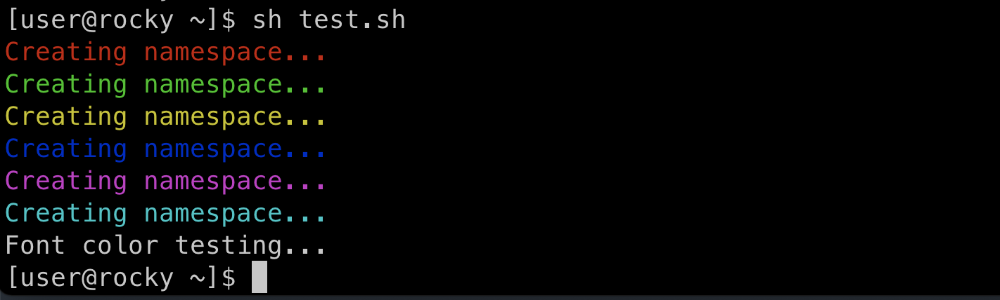

**color in bash**

**1) Color setting**
```bash
# Color control constants
Color_Off='\033[0m'       # Text Resets
Black='\033[0;30m'        # Black
Red='\033[0;31m'          # Red
Green='\033[0;32m'        # Green
Yellow='\033[0;33m'       # Yellow
Blue='\033[0;34m'         # Blue
Purple='\033[0;35m'       # Purple
Cyan='\033[0;36m'         # Cyan
White='\033[0;37m'        # White

```


**2) view color**
```bash
# view color
printf "${Red}Font color testing...\n${Color_Off}"
printf "${Green}Font color testing...\n${Color_Off}"
printf "${Yellow}Font color testing...\n${Color_Off}"
printf "${Blue}Font color testing...\n${Color_Off}"
printf "${Purple}Font color testing...\n${Color_Off}"
printf "${Cyan}Font color testing...\n${Color_Off}"
printf "Font color testing...\n"
```


**3) result font color**

